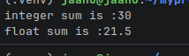
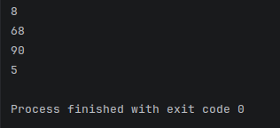
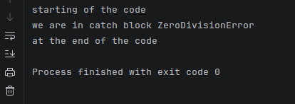
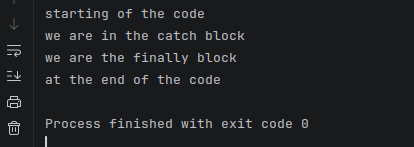
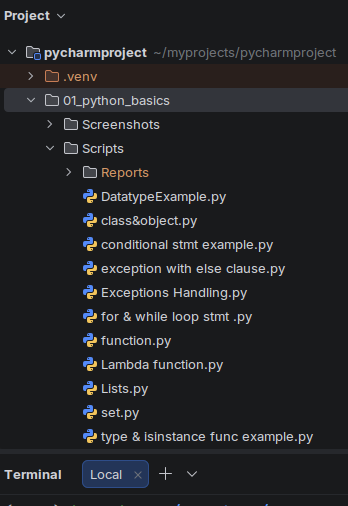

# 🐍 Python Basics

  

> **Foundation for QA automation** — practical Python scripts covering the programming concepts used throughout this repository.

---

## 🎯 Purpose

This section builds the Python foundation required to write, organize and maintain QA automation scripts. Each topic is demonstrated through a focused `.py` file.

---

## 📚 Topics

### 🔢 Data Types
Integers, floats and strings, together with basic type inspection.

📄 **Script:** [`DatatypeExample.py`](Scripts/DatatypeExample.py)

#### 📸 Output

---

### 🔍 `type()` & `isinstance()`
Demonstrates runtime type inspection and type checking.

📄 **Script:** [type & isinstance func example.py](<Scripts/type & isinstance func example.py>)

#### 📸 Output

---

### 🔀 Conditional Statements
Uses `if` / `else` logic to control execution based on conditions.

📄 **Script:** [conditional stmt example.py](<Scripts/conditional stmt example.py>)

#### 📸 Output

---

### 🔁 For & While Loops
Demonstrates repeated execution using `for` and `while` loops.

📄 **Script:** [for & while loop stmt .py](<Scripts/for & while loop stmt .py>)

#### 📸 Output

---

### 🧩 Functions
Functions, parameters and return values for reusable logic.

📄 **Script:** [function.py](Scripts/function.py)

#### 📸 Output

---

### 📋 Lists
Python list creation and common list operations.

📄 **Script:** [`Lists.py`](Scripts/Lists.py)

#### 📸 Output

---

### 🧺 Sets
Set data structures and unique-value behavior.

📄 **Script:** [`set.py`](Scripts/set.py)

#### 📸 Output

---

### ⚡ Lambda Functions
Compact anonymous functions using Python `lambda` syntax.

A lambda function is a small anonymous function defined using the `lambda` keyword. 
It can take any number of arguments but contains only a single expression.

📄 **Script:** [Lambda function.py](<Scripts/Lambda function.py>)

#### 📸 Output

---
### 🏗️ Classes & Objects
Introduces object-oriented programming through classes and object instances.

A **class** is a blueprint used to define the attributes and behaviors of an object. 
An **object** is an instance of a class created from that blueprint.

📄 **Script:** [class&object.py](<Scripts/class&object.py>)

#### 📸 Output

---

### 🛡️ Exception Handling
Uses `try`, `except`, `else` and `finally` for controlled error handling.

📄 **Script:** [Exceptions Handling.py](Exceptions Handling.py)

#### 📸 Output

---

### ➕ Exception Handling with `else`
Demonstrates execution of the `else` block when no exception occurs.

📄 **Script:** [exception with else clause.py](Scripts/exception with else clause.py)

#### 📸 Output

---

## 🖼️ Existing Project Evidence

---

## 🔑 Key Takeaway

These scripts establish the Python programming foundation used by the Pytest and Playwright automation sections.
