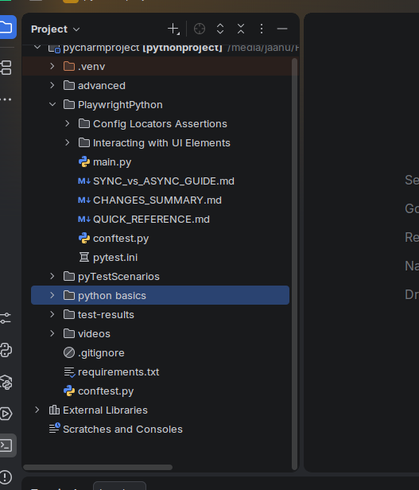

# 🐍 Python Basics

  

> **Foundation for QA automation** — practical Python scripts covering the programming concepts used throughout this repository.

---

## 🎯 Purpose

This section builds the Python foundation required to write, organize and maintain QA automation scripts. Each topic is demonstrated through a focused `.py` file.

---

## 📚 Topics

### 🔢 Data Types
Integers, floats and strings, together with basic type inspection.

📄 **Script:** [`DatatypeExample.py`](DatatypeExample.py)

#### ▶️ Run / Output

*Execution evidence captured from the project run.*

---

### 🔍 `type()` & `isinstance()`
Demonstrates runtime type inspection and type checking.

📄 **Script:** [`type%20%26%20isinstance%20func%20example.py`](type%20%26%20isinstance%20func%20example.py)

#### ▶️ Run / Output

*Execution evidence captured from the project run.*

---

### 🔀 Conditional Statements
Uses `if` / `else` logic to control execution based on conditions.

📄 **Script:** [`conditional%20stmt%20example.py`](conditional%20stmt%20example.py)

#### ▶️ Run / Output

*Execution evidence captured from the project run.*

---

### 🔁 For & While Loops
Demonstrates repeated execution using `for` and `while` loops.

📄 **Script:** [`for%20%26%20while%20loop%20stmt%20.py`](for%20%26%20while%20loop%20stmt%20.py)

#### ▶️ Run / Output

*Execution evidence captured from the project run.*

---

### 🧩 Functions
Functions, parameters and return values for reusable logic.

📄 **Script:** [`function.py`](function.py)

#### ▶️ Run / Output

*Execution evidence captured from the project run.*

---

### 📋 Lists
Python list creation and common list operations.

📄 **Script:** [`Lists.py`](Lists.py)

#### ▶️ Run / Output

*Execution evidence captured from the project run.*

---

### 🧺 Sets
Set data structures and unique-value behavior.

📄 **Script:** [`set.py`](set.py)

#### ▶️ Run / Output

*Execution evidence captured from the project run.*

---

### ⚡ Lambda Functions
Compact anonymous functions using Python `lambda` syntax.

📄 **Script:** [`Lambda%20function.py`](Lambda%20function.py)

#### ▶️ Run / Output

*Execution evidence captured from the project run.*

---

### 🏗️ Classes & Objects
Introduces object-oriented programming through classes and object instances.

📄 **Script:** [`class%26object.py`](class%26object.py)

#### ▶️ Run / Output

*Execution evidence captured from the project run.*

---

### 🛡️ Exception Handling
Uses `try`, `except`, `else` and `finally` for controlled error handling.

📄 **Script:** [`Exceptions%20Handling.py`](Exceptions%20Handling.py)

#### ▶️ Run / Output

*Execution evidence captured from the project run.*

---

### ➕ Exception Handling with `else`
Demonstrates execution of the `else` block when no exception occurs.

📄 **Script:** [`exception%20with%20else%20clause.py`](exception%20with%20else%20clause.py)

#### ▶️ Run / Output

*Execution evidence captured from the project run.*

---

## 🖼️ Existing Project Evidence

---

## 🔑 Key Takeaway

These scripts establish the Python programming foundation used by the Pytest and Playwright automation sections.
