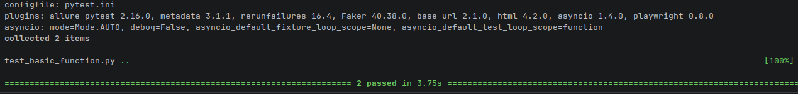
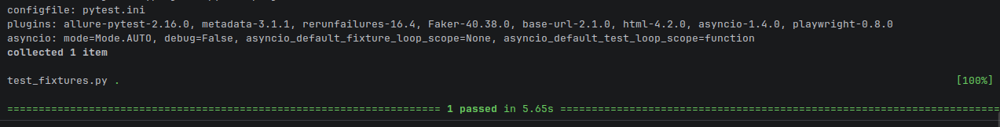
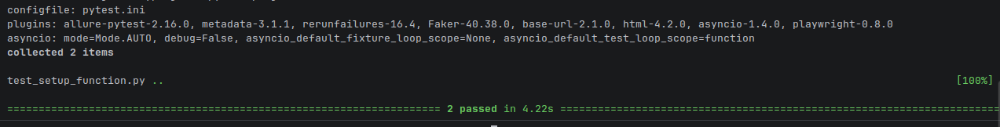
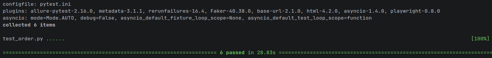

# 🧪 Pytest Scenarios

  

> **Test organization and execution fundamentals** — practical Pytest scenarios used to structure, execute and validate automated tests.

---

## 🎯 Purpose

This section demonstrates the core Pytest mechanisms used to organize test scenarios, prepare test state, validate results and control execution.

---

## 📚 Topics

### 🧪 Test Functions
Pytest discovers test functions using conventions such as the `test_` prefix. Separate test functions make scenarios easier to identify and maintain.

📄 **Script:** [`test_basic_function.py`](Scripts/test_basic_function.py)

#### 📸 Output

---

### ✅ Assertions
Assertions compare actual results with expected results and determine whether a test passes or fails.

📄 **Script:** [`test_assertions.py`](Scripts/test_assertions.py)

#### 📸 Output

---

### 🔧 Fixtures
Fixtures provide reusable setup or test data to test functions.

📄 **Script:** [`test_fixtures.py`](Scripts/test_fixtures.py)

#### 📸 Output

---

### 🔄 Setup & Teardown
Setup prepares the test environment and teardown performs required cleanup.

📄 **Script:** [`test_setup_function.py`](Scripts/test_setup_function.py)

#### 📸 Output

📄 **Script:** [`test_setup_module.py`](Scripts/test_setup_module.py)

#### 📸 Output

---

### 🏷️ Markers
Markers categorize tests so selected groups can be executed independently.

📄 **Script:** [`test_markers.py`](Scripts/test_markers.py)

#### 📸 Output

---

### 🔢 Test Ordering
Demonstrates ordered execution with `pytest.mark.order`. Independent tests are generally easier to maintain because they do not depend on another test's state.

📄 **Script:** [`test_order.py`](Scripts/test_order.py)

#### 📸 Output

---

### 🔁 Parameterization

Runs the same test logic with multiple sets of input data.

Parameterization allows the same test to run with different input values without duplicating the test code.

📄 **Script:** [test_paramater_mark.py](Scripts/test_paramater_mark.py)

#### 📸 Output

---

## ⚙️ Test Configuration

[`pytest.ini`](../pytest.ini) is the project-level Pytest configuration file. It defines test discovery rules, registered markers and default execution options used across the automation project.

It is located at the repository root and applies to the relevant Pytest test suites; it is not a test script specific to this folder.

---

## 🔑 Key Takeaway

These scenarios demonstrate the Pytest mechanisms used to structure reliable automation: test functions, assertions, fixtures, setup/teardown, markers, ordering and parameterized execution.
