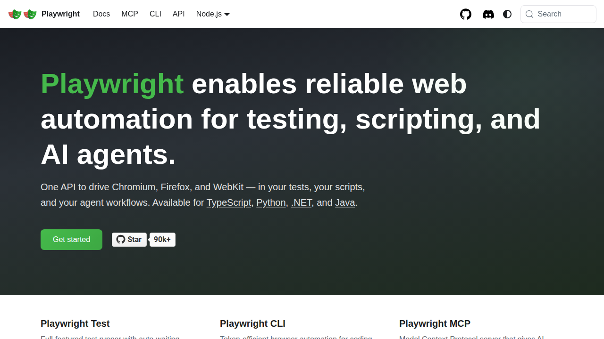

# 🎭 Playwright Configuration, Locators & Assertions

  

> **Element identification + validation** — Playwright configuration, locator strategies and assertion-based browser validation.

---

## 🎯 Purpose

This section demonstrates how Playwright identifies elements, interacts with web pages and validates application state.

---

## 📚 Topics

### ⚙️ Playwright Configuration
The examples use Playwright with Pytest for browser-driven automation.

📄 **Script:** [`test_example.py`](Scripts/test_example.py)

#### 📸 Output
Actual execution screenshot will be added here.

---

### 🔹 get_by_role()
Semantic role-based element identification.

📄 **Script:** [`test_getbyrole.py`](Scripts/test_getbyrole.py)

#### 📸 Output
Actual execution screenshot will be added here.

---
### 🔹 get_by_text()
Locating elements by visible text.

📄 **Script:** [`test_getbytext.py`](Scripts/test_getbytext.py)

#### 📸 Output
Actual execution screenshot will be added here.

---
### 🔹 get_by_label()
Locating form controls through their associated labels.

📄 **Script:** [`test_getbylabel.py`](Scripts/test_getbylabel.py)

#### 📸 Output
Actual execution screenshot will be added here.

---
### 🔹 get_by_placeholder()
Locating inputs by placeholder text.

📄 **Script:** [`test_getbyplaceholder.py`](Scripts/test_getbyplaceholder.py)

#### 📸 Output
Actual execution screenshot will be added here.

---
### 🔹 get_by_test_id()
Locating elements using test identifiers.

📄 **Script:** [`test_getbytestid.py`](Scripts/test_getbytestid.py)

#### 📸 Output
Actual execution screenshot will be added here.

---
### 🔹 get_by_alt_text()
Locating images and elements using alternative text.

📄 **Script:** [`test_getbyalttext.py`](Scripts/test_getbyalttext.py)

#### 📸 Output
Actual execution screenshot will be added here.

---
### 🔹 get_by_title()
Locating elements using title attributes.

📄 **Script:** [`test_getbytitle.py`](Scripts/test_getbytitle.py)

#### 📸 Output
Actual execution screenshot will be added here.

---
### 🔹 CSS Selectors
CSS-based element selection.

📄 **Script:** [`test_cssSelector.py`](Scripts/test_cssSelector.py)

#### 📸 Output
Actual execution screenshot will be added here.

---
### 🔹 XPath
XPath-based element selection for complex locator requirements.

📄 **Script:** [`test_xpath.py`](Scripts/test_xpath.py)

#### 📸 Output
Actual execution screenshot will be added here.

---
### 🔹 Assertions
Playwright expect() validations for visible, enabled, title, URL and heading state.

📄 **Script:** [`test_LocatorAssertions.py`](Scripts/test_LocatorAssertions.py)

#### 📸 Output
Actual execution screenshot will be added here.

---
### 🔹 Shadow DOM
Locating elements inside Shadow DOM.

📄 **Script:** [`test_locateinShadowDOM.py`](Scripts/test_locateinShadowDOM.py)

#### 📸 Output
Actual execution screenshot will be added here.

---

### 🧬 Generator Example
An additional Playwright example included in this learning section.

📄 **Script:** [`test_generator.py`](Scripts/test_generator.py)

#### 📸 Output
Actual execution screenshot will be added here.

---

## 🖼️ Existing Project Evidence

---

## 🔑 Key Takeaway

This section demonstrates practical Playwright element identification and validation using semantic locators, CSS, XPath, Shadow DOM interaction and `expect()` assertions.
