# 🎭 Playwright Configuration, Locators & Assertions

  

> **Element identification + validation** — Playwright configuration, locator strategies and assertion-based browser validation.

---

## 🎯 Purpose

This section demonstrates how Playwright identifies elements, interacts with web pages and validates application state.

---

## 📚 Topics

### 🧪 Test Example

The `test_example.py` script demonstrates the basic Playwright test setup and browser interaction used in this section.

📄 **Script:** [test_example.py](Scripts/test_example.py)

#### 📸 Output

---

### 🔹 get_by_role()
Semantic role-based element identification.

📄 **Script:** [`test_getbyrole.py`](Scripts/test_getbyrole.py)

#### 📸 Output

---
### 🔹 get_by_text()

Locating elements by visible text.

📄 **Script:** [test_getbytext.py](Scripts/test_getbytext.py)

#### 📸 Output

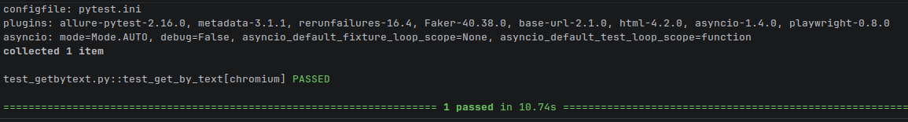

---
### 🔹 get_by_label()

Locating form controls through their associated labels.

📄 **Script:** [test_getbylabel.py](Scripts/test_getbylabel.py)

#### 📸 Output

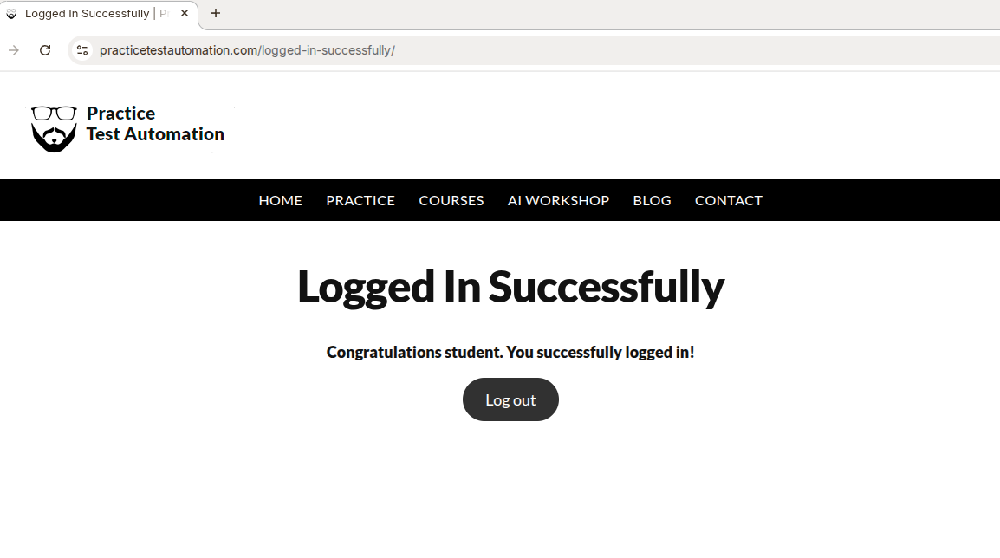

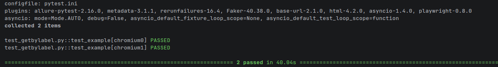

---
### 🔹 get_by_placeholder()

Locating input fields using their placeholder text.

📄 **Script:** [test_getbyplaceholder.py](Scripts/test_getbyplaceholder.py)

#### 📸 Output

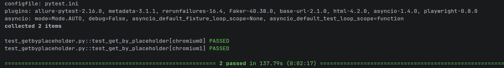

---
### 🔹 get_by_test_id()

Locating elements using a unique test ID assigned to the element.

📄 **Script:** [test_getbytestid.py](Scripts/test_getbytestid.py)

#### 📸 Output

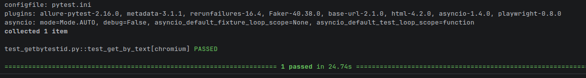

---
### 🔹 get_by_alt_text()

Locating images and elements using alternative text.

📄 **Script:** [test_getbyalttext.py](Scripts/test_getbyalttext.py)

#### 📸 Output

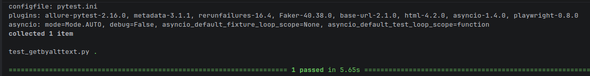

---
### 🔹 get_by_title()

Locating elements using title attributes.

📄 **Script:** [test_getbytitle.py](Scripts/test_getbytitle.py)

#### 📸 Output

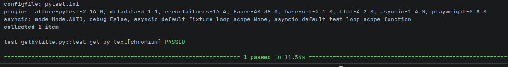

---
### 🔹 CSS Selectors

Selecting elements using CSS-based locator selectors.

📄 **Script:** [test_cssSelector.py](Scripts/test_cssSelector.py)

#### 📸 Output

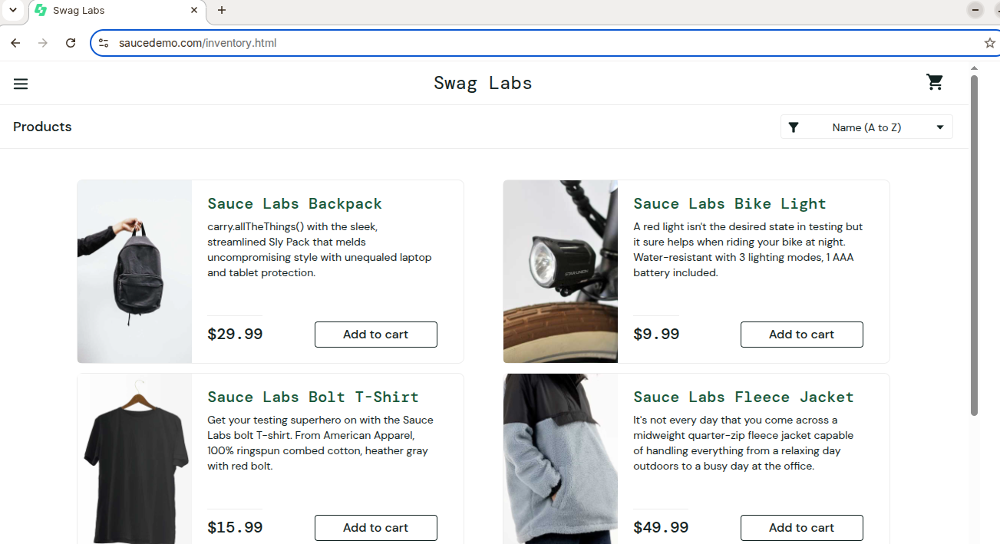

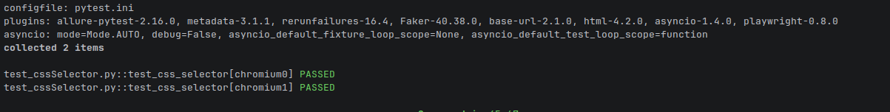

---
### 🔹 XPath

Selecting elements using XPath expressions for complex locator requirements.

📄 **Script:** [test_xpath.py](Scripts/test_xpath.py)

#### 📸 Output

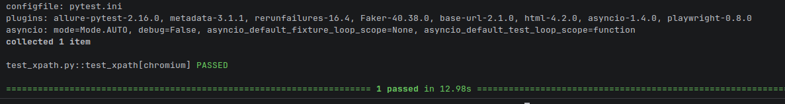

---
### 🔹 Assertions

Playwright `expect()` validations for visible, enabled, title, URL and heading state.

📄 **Script:** [test_LocatorAssertions.py](Scripts/test_LocatorAssertions.py)

#### 📸 Output

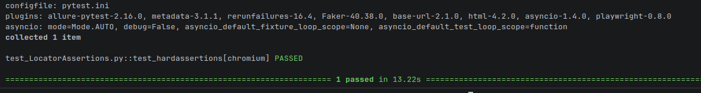

---
### 🔹 Shadow DOM

Locating and interacting with elements inside a Shadow DOM.

This script demonstrates how Playwright accesses elements within Shadow DOM boundaries.

📄 **Script:** [test_locateinShadowDOM.py](Scripts/test_locateinShadowDOM.py)

#### 📸 Output

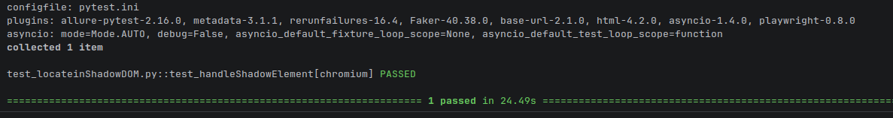

---

### 🔹 Generator Example

Demonstrates Playwright's code generator for creating test code from browser interactions.

This script shows how recorded browser actions can be converted into Playwright test code.

📄 **Script:** [test_generator.py](Scripts/test_generator.py)

#### 📸 Output

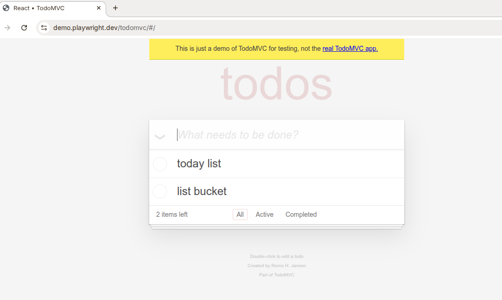

---

## ⚙️ Playwright Configuration

Playwright runs these browser-based tests through Pytest. The project-level `pytest.ini` provides the default browser and execution settings used by the tests in this section.

📄 **Configuration:** [pytest.ini](../pytest.ini)

---

## 🖼️ Existing Project Evidence

---

## 🔑 Key Takeaway

This section demonstrates practical Playwright element identification and validation using semantic locators, CSS, XPath, Shadow DOM interaction and `expect()` assertions.
