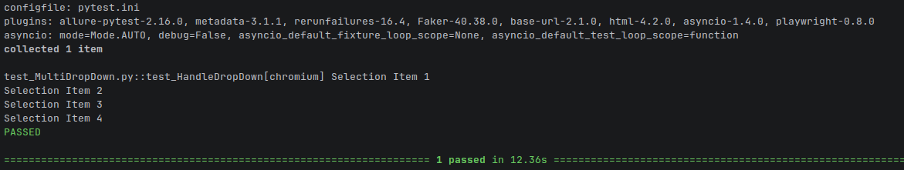
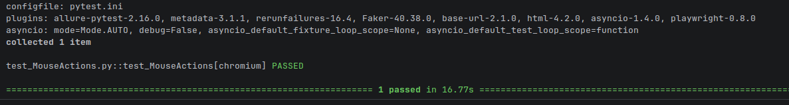
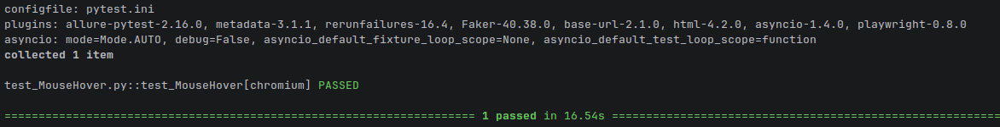
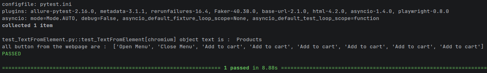

# 🖱️ Playwright UI Elements — Basic

  

> **Core UI automation** — practical Playwright interactions with common web controls and user actions.

---

## 🎯 Purpose

This section demonstrates common browser interactions and follows a simple automation pattern: **locate → act → validate**.

---

## 📚 Topics

### 🖊️ Text Fields

Entering and handling values in text input fields.

📄 **Script:** [test_handletextfields.py](Scripts/test_handletextfields.py)

#### 📸 Output

---

### ☑️ Checkboxes

Selecting and validating checkbox controls.

📄 **Script:** [test_multi_checkbox.py](Scripts/test_multi_checkbox.py)

#### 📸 Output

---

### 🔽 Dropdowns

Selecting values from standard dropdown controls and validating the selected value.

📄 **Script:** [test_handleDropDown.py](Scripts/test_handleDropDown.py)

#### 📸 Output

📄 **Script:** [test_getvaluefromDropDown.py](Scripts/test_getvaluefromDropDown.py)

#### 📸 Output

---

### 🔽 Multi-Select Dropdown

Selecting multiple options from a multi-select dropdown control.

📄 **Script:** [test_MultiDropDown.py](Scripts/test_MultiDropDown.py)

#### 📸 Output

---

### 🖱️ Mouse Actions

Browser mouse interactions such as movement and clicking.

📄 **Script:** [test_MouseActions.py](Scripts/test_MouseActions.py)

#### 📸 Output

---

### 🖱️ Mouse Hover

Hovering over a web element to trigger a UI interaction.

📄 **Script:** [test_MouseHover.py](Scripts/test_MouseHover.py)

#### 📸 Output

---

### 📝 Text Extraction

Retrieving text from a web element and validating the result.

📄 **Script:** [test_TextFromElement.py](Scripts/test_TextFromElement.py)

#### 📸 Output

---

## 🖼️ Existing Project Evidence

---

## 🔑 Key Takeaway

These scenarios establish the core Playwright interaction skills required for automating common web controls, user actions and UI validations.
