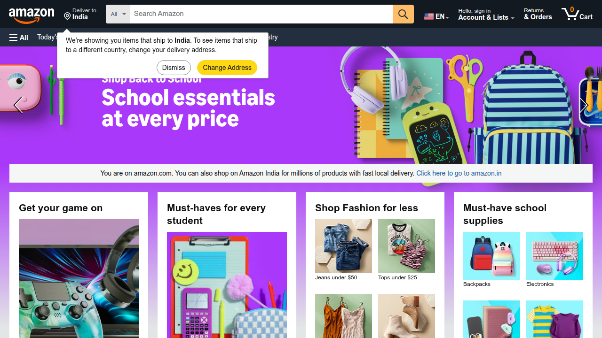

# 🚀 Playwright UI Elements — Advanced

  

> **Advanced browser automation** — complex interactions, browser behavior, synchronization and end-to-end workflow automation.

---

## 🎯 Purpose

This section moves beyond basic controls into browser-level scenarios covering tables, dialogs, frames, multiple pages, browser contexts, synchronization, authentication, file handling, screenshots, videos and end-to-end automation.

---

## 📚 Topics

### 🔹 Web Tables
Locating and validating data within web tables.

📄 **Script:** [`test_WebTables.py`](Scripts/test_WebTables.py)

#### 📸 Output
Actual execution screenshot will be added here.

---
### 🔹 Dynamic Web Tables
Working with table data that changes dynamically.

📄 **Script:** [`test_DynamicWebTables.py`](Scripts/test_DynamicWebTables.py)

#### 📸 Output
Actual execution screenshot will be added here.

---
### 🔹 Tooltips
Interacting with and validating tooltip behavior.

📄 **Script:** [`test_Tooltip.py`](Scripts/test_Tooltip.py)

#### 📸 Output
Actual execution screenshot will be added here.

---
### 🔹 Alerts & Confirm Dialogs
Handling browser alert and confirmation dialogs.

📄 **Script:** [`test_AlertConfirm.py`](Scripts/test_AlertConfirm.py)

#### 📸 Output
Actual execution screenshot will be added here.

---
### 🔹 Alert Handling
Additional browser dialog handling.

📄 **Script:** [`test_HandlingAlerts.py`](Scripts/test_HandlingAlerts.py)

#### 📸 Output
Actual execution screenshot will be added here.

---
### 🔹 Frames
Interacting with elements inside frames.

📄 **Script:** [`test_HandlingFrames.py`](Scripts/test_HandlingFrames.py)

#### 📸 Output
Actual execution screenshot will be added here.

---
### 🔹 Child Frames
Handling nested or child frame content.

📄 **Script:** [`test_HandlingChildFrames.py`](Scripts/test_HandlingChildFrames.py)

#### 📸 Output
Actual execution screenshot will be added here.

---
### 🔹 Multiple Windows / Tabs
Handling multiple browser pages opened during a test.

📄 **Script:** [`test_MultipleWindows.py`](Scripts/test_MultipleWindows.py)

#### 📸 Output
Actual execution screenshot will be added here.

---
### 🔹 Browser Context
Using isolated browser contexts for independent sessions.

📄 **Script:** [`test_BrowserContext.py`](Scripts/test_BrowserContext.py)

#### 📸 Output
Actual execution screenshot will be added here.

---
### 🔹 Drag & Drop
Automating drag-and-drop interaction.

📄 **Script:** [`test_DragAndDrop.py`](Scripts/test_DragAndDrop.py)

#### 📸 Output
Actual execution screenshot will be added here.

---
### 🔹 Auto-Suggestions
Working with dynamic suggestion lists.

📄 **Script:** [`test_AutoSuggestions.py`](Scripts/test_AutoSuggestions.py)

#### 📸 Output
Actual execution screenshot will be added here.

---
### 🔹 Auto-Waiting
Playwright synchronization for dynamic elements.

📄 **Script:** [`test_AutoWaiting.py`](Scripts/test_AutoWaiting.py)

#### 📸 Output
Actual execution screenshot will be added here.

---
### 🔹 Authentication Popup
Handling browser authentication requirements.

📄 **Script:** [`test_AuthLoginPopup.py`](Scripts/test_AuthLoginPopup.py)

#### 📸 Output
Actual execution screenshot will be added here.

---
### 🔹 File Upload
Uploading files through Playwright.

📄 **Script:** [`test_UploadFiles.py`](Scripts/test_UploadFiles.py)

#### 📸 Output
Actual execution screenshot will be added here.

---
### 🔹 Screenshots
Capturing screenshots as execution evidence.

📄 **Script:** [`test_CaptureScreenshots.py`](Scripts/test_CaptureScreenshots.py)

#### 📸 Output
Actual execution screenshot will be added here.

---
### 🔹 Video Recording
Recording browser execution during automation.

📄 **Script:** [`test_CaptureVideos.py`](Scripts/test_CaptureVideos.py)

#### 📸 Output
Actual execution screenshot will be added here.

---
### 🔹 Date Picker
Interacting with a date picker control.

📄 **Script:** [`test_DatePicker.py`](Scripts/test_DatePicker.py)

#### 📸 Output
Actual execution screenshot will be added here.

---
### 🔹 Base URL
Using configured base URLs for relative navigation.

📄 **Script:** [`test_BaseURL.py`](Scripts/test_BaseURL.py)

#### 📸 Output
Actual execution screenshot will be added here.

---
### 🔹 Rerun Failures
Configuring Pytest rerun behavior for failed tests.

📄 **Script:** [`test_rerunfailures.py`](Scripts/test_rerunfailures.py)

#### 📸 Output
Actual execution screenshot will be added here.

---
### 🔹 End-to-End Automation
Combining browser capabilities into a complete workflow.

📄 **Script:** [`test_E2EScenarioAutomation.py`](Scripts/test_E2EScenarioAutomation.py)

#### 📸 Output
Actual execution screenshot will be added here.

---

## 🖼️ Existing Project Evidence

---

## 🔑 Key Takeaway

These scenarios demonstrate advanced Playwright browser capabilities and show how individual browser techniques can be combined into practical end-to-end automation.
