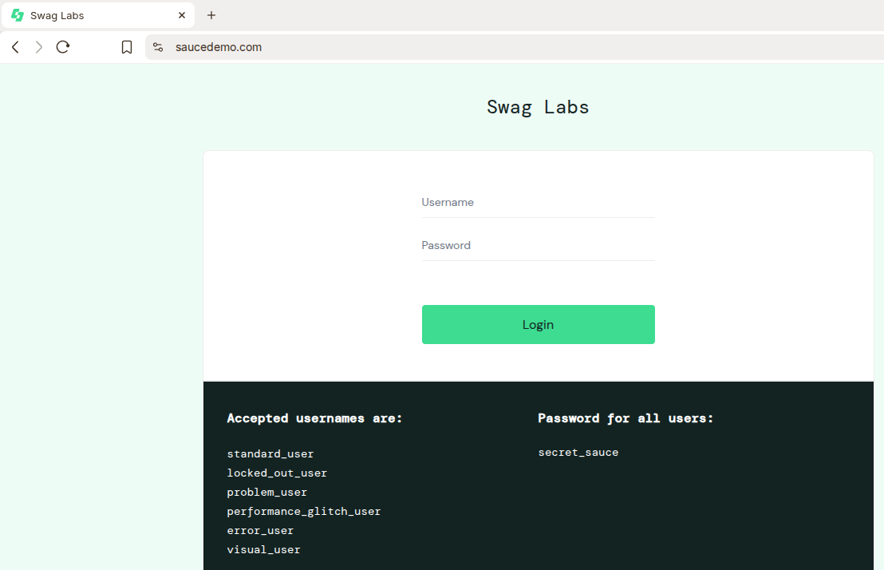
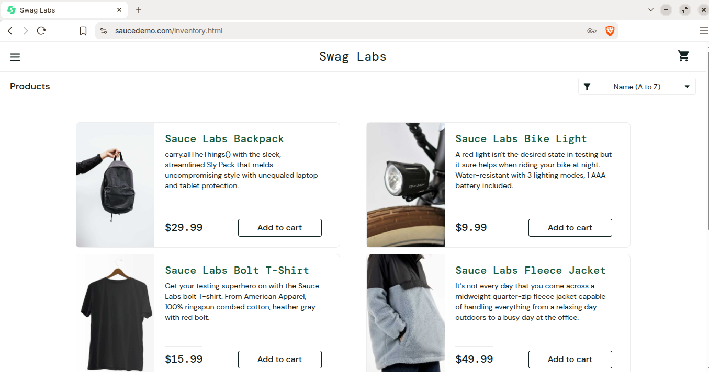
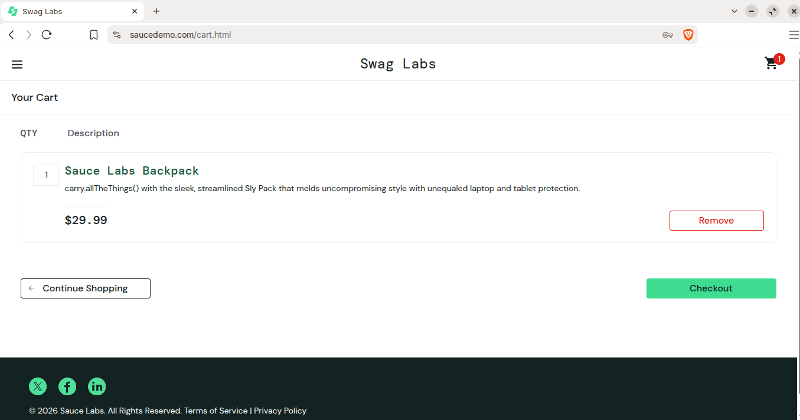
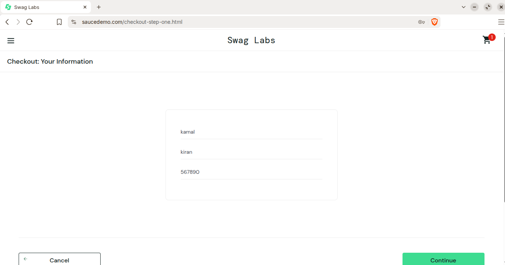
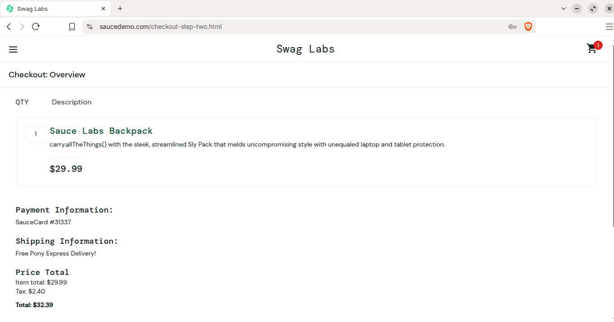
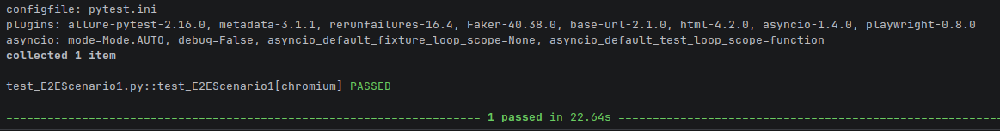
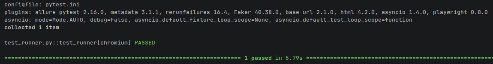
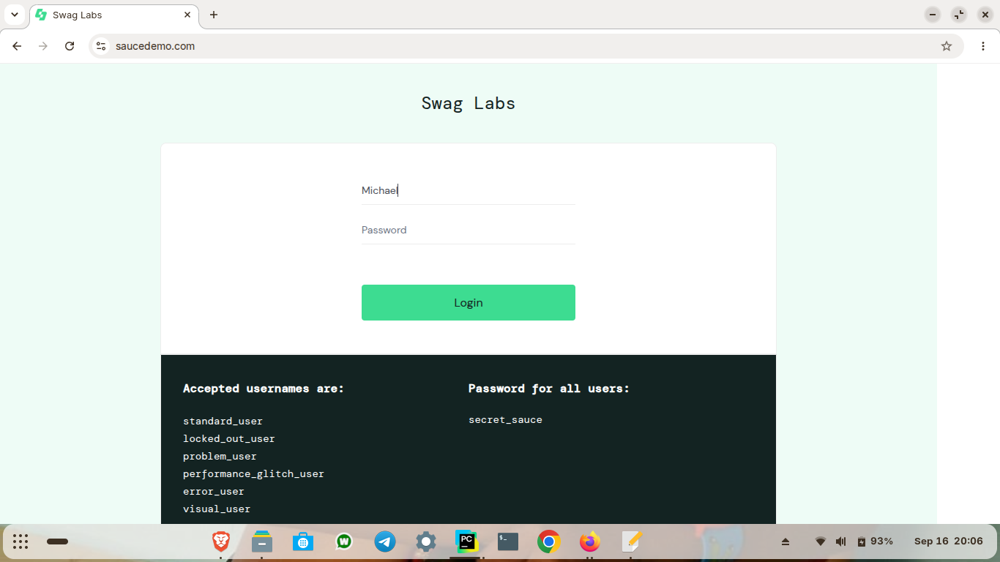

# 🧱 Playwright Page Object Model

[](https://www.python.org/) [](https://docs.pytest.org/) [](https://playwright.dev/python/)

> **Reusable automation architecture** — Page Object Model implementation using Playwright and Pytest for a SauceDemo end-to-end workflow.

---

## 🎯 Purpose

This section separates page-specific locators and actions into reusable classes while keeping the test scenario focused on the business workflow and validation.

---

## 📚 Topics

### 🔐 Login Page Object

Encapsulates SauceDemo login elements and actions.

📄 **Script:** [LoginPage.py](Scripts/pages/LoginPage.py)

#### 📸 Output



---

### 🏠 Home Page Object

Encapsulates product-page interactions and shopping-cart actions.

📄 **Script:** [HomePage.py](Scripts/pages/HomePage.py)

#### 📸 Output



---

### 🛒 Cart Page Object

Encapsulates shopping-cart interactions.

📄 **Script:** [CartPage.py](Scripts/pages/CartPage.py)

#### 📸 Output



---

### 🧾 Checkout Information Page Object

Encapsulates customer information used during checkout.

📄 **Script:** [InfoPage.py](Scripts/pages/InfoPage.py)

#### 📸 Output



---

### 📋 Overview Page Object

Encapsulates order review and final checkout actions.

📄 **Script:** [OverviewPage.py](Scripts/pages/OverviewPage.py)

#### 📸 Output



---

### 🎲 Test Data Generation

Generates dynamic customer data using Faker and random values for checkout testing.

📄 **Script:** [Random_Data.py](Scripts/pages/Random_Data.py)

---

### 🔄 End-to-End Test Scenario

Coordinates the page objects through the complete SauceDemo customer workflow.

**Workflow**

`Login → Product → Cart → Checkout → Customer Information → Review → Place Order → Logout`

📄 **Script:** [test_E2EScenario1.py](Scripts/pages/test_E2EScenario1.py)

#### 📸 Output



---

### ▶️ Test Runner

Provides the test-runner entry point used with the page-object implementation.

📄 **Script:** [test_runner.py](Scripts/pages/test_runner.py)

#### 📸 Output





---

## 🧩 Page Object Structure

```text
06_playwright_page_object_model/
└── Scripts/pages/
    ├── LoginPage.py
    ├── HomePage.py
    ├── CartPage.py
    ├── InfoPage.py
    ├── OverviewPage.py
    ├── Random_Data.py
    ├── test_E2EScenario1.py
    └── test_runner.py
```
---

## 🖼️ Existing Project Evidence


---

## 🔑 Key Takeaway

The Page Object Model section demonstrates how Playwright automation can move from individual scripts toward reusable, readable and maintainable end-to-end test design.
